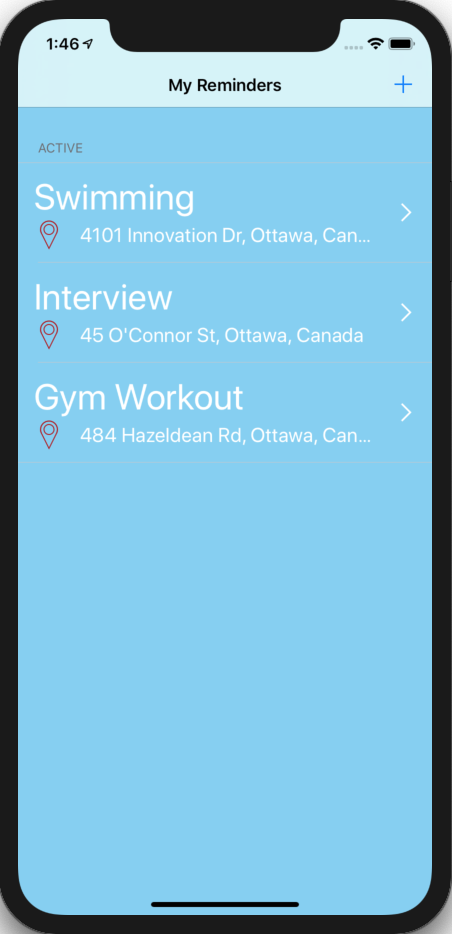
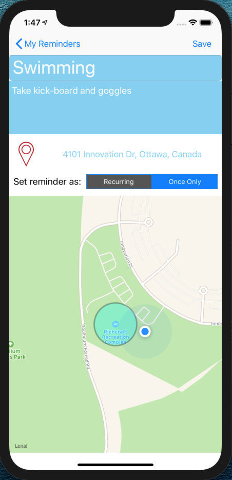
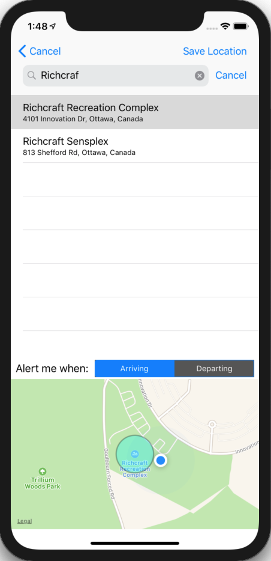
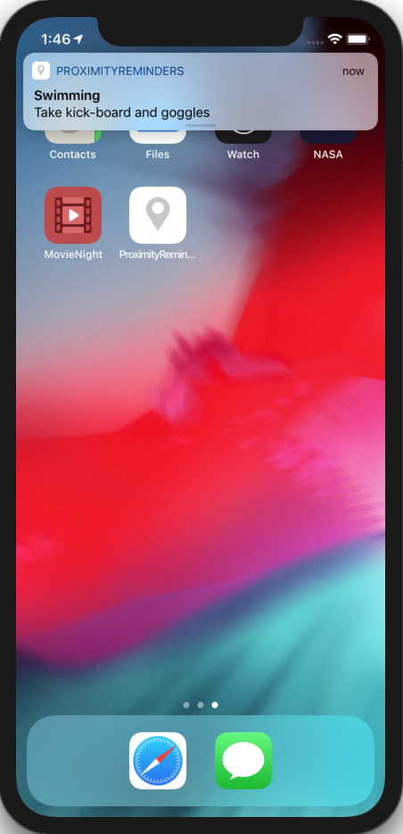
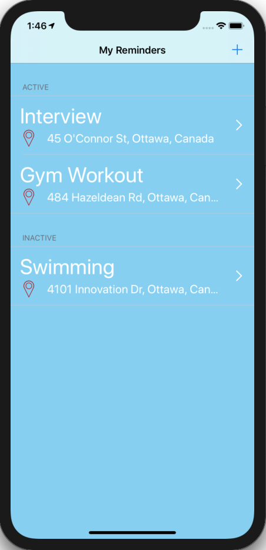
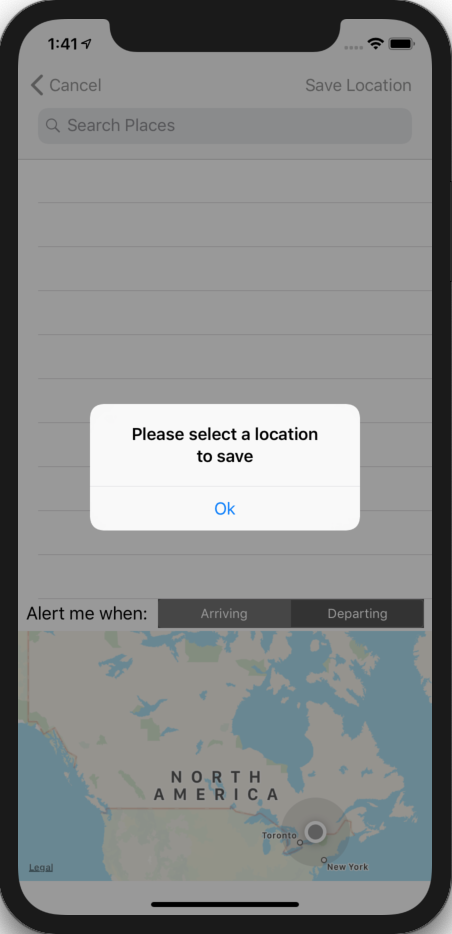

# Team Treehouse TechDegree Project 9

## Proximity Reminders App

**App Description:**  Location Specific Reminders App.  User enters reminder information with location data to trigger a reminder notification.  The reminder can be triggered on entry or exit of a particular area, and designated as recurring or one-off.  Reminder entries are persistent.

**Swift Features Used:**
Local Notifications, Geolocation, Persistence with Core Data, Fetched Results Controller, Master Detail Interface, Table Views, Delegation, Search Controller, Location Manager. 

**Screenshots:**

